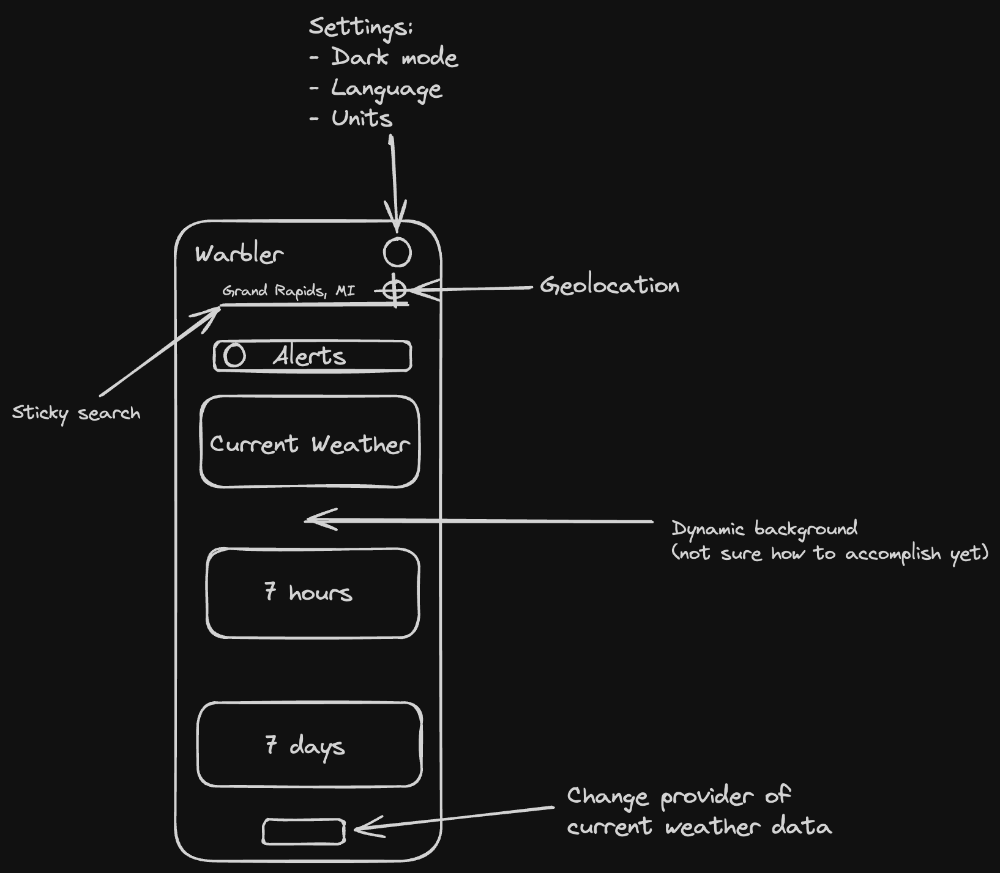

# Warbler Weather

## Technologies

- Angular 17
- Weather API (weather)
- OpenWeather (alternative for current weather & geocoding)
- https://www.weather.gov/documentation/services-web-api (alerts)
- ngx-translate (localization)
- Cypress (e2e testing)

## Color Palette

Option 1: https://coolors.co/palette/606c38-283618-fefae0-dda15e-bc6c25

Option 2: https://coolors.co/palette/dad7cd-a3b18a-588157-3a5a40-344e41

Option 3: Something really simple (black and white with a pop of color)

## Features

- Location Search: Users should be able to enter a city or zip code to get the current weather conditions and forecast for that location.
- Weather Display: Display relevant weather information such as temperature, humidity, wind speed, and weather conditions (e.g., sunny, cloudy, rainy).
- Dynamic Background: Change the background image or color based on the current weather conditions to provide visual cues to users.
- Unit Conversion: Provide an option to switch between different units of measurement (e.g., Celsius/Fahrenheit, mph/kph) for temperature and wind speed.
- Responsive Design: Ensure that the application is responsive and works well on different devices, including desktops, tablets, and smartphones.
- Geolocation: Use the browser's geolocation API to automatically detect the user's location and display the weather information accordingly.
- Multiple Weather Providers: Fetch weather data from multiple APIs or providers to improve accuracy and reliability.
- Extended Forecast: Include an extended forecast for the upcoming days, allowing users to plan ahead.
- Weather Alerts: Implement a feature to display weather alerts or warnings for severe weather conditions.
- Localization: Support multiple languages and provide an option for users to switch between different languages.
- Dark Mode: Provide an option to switch between light and dark mode for the application.

## How to run the application locally

1. Clone the repository
2. cd into the project directory (warbler-weather)
3. Run `npm install`
4. Run `ng serve`
5. Open your browser and navigate to `http://localhost:4200/`
6. Huzzah! 🎉

## "Wireframe"

